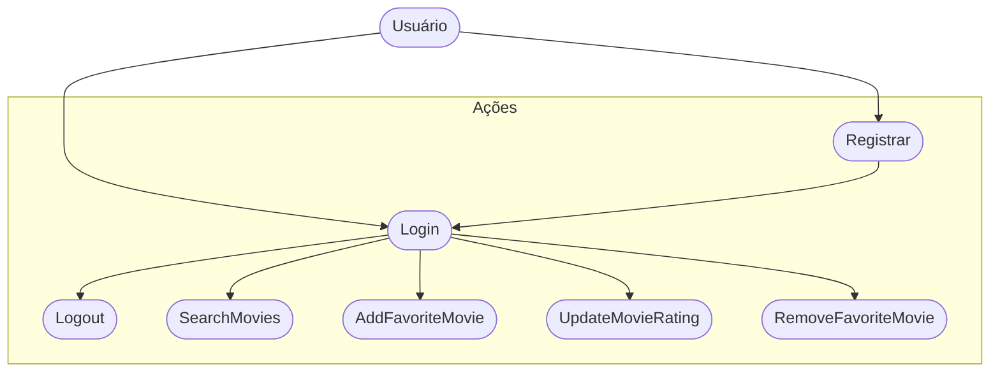

# CineFavorite (Formativa)

## Briefing
Construir um Aplicativo do Zero - O CineFavorite que permitirá criar uma conte e buscar filmes em uma API, montar uma galeria pessoal de filmes favoritos, com poster(capa) e nota avaliativa do usuário para o filme.

## Objetivos
- Criar uma Galeria Personalizada por Usuário de filmes favoritos
- Buscar filmes em uma API e Listar pra selecionar filmes fav
- Criação de contas por Usuario
- Listar filmes por palavra chave

## Levantamento de Requisitos
- ## Funcionais
- Registro de usuário – permitir que novos usuários criem uma conta utilizando e-mail e senha.
- Entrar/Sair – realizar o login dos usuários e permitir o logout da conta.
- Busca de filmes – realizar consultas na API do TMDB com base em palavras-chave informadas.
- Listagem de filmes – apresentar os resultados da busca com título e imagem do pôster.
- Favoritar filmes – possibilitar que o usuário adicione filmes a uma lista pessoal.
- Avaliação de filmes – permitir que o usuário atribua uma nota aos filmes salvos como favoritos.
- Atualizar avaliação – dar ao usuário a opção de modificar a nota atribuída anteriormente a um filme.
- Remover favoritos – permitir que o usuário exclua filmes da sua coleção pessoal.
- Ver galeria pessoal – exibir todos os filmes que o usuário marcou como favoritos.
- ## Não funcionais
- Conversão de dados – transformar o conteúdo em JSON da API em objetos internos do tipo Movie.
- Integração com Firestore – realizar operações de leitura, gravação, atualização e remoção dos dados de favoritos.
- Login com Firebase Auth – utilizar a autenticação do Firebase para gerenciar o acesso dos usuários.
- Sessão persistente – manter o usuário autenticado mesmo após o encerramento do aplicativo.
- Gerenciamento de erros – tratar falhas e exceções sem impactar negativamente a experiência do usuário.
- Arquitetura em camadas – organizar o código separando responsabilidades entre modelos, serviços e visualizações.
- Atualização em tempo real – sincronizar automaticamente os dados de favoritos com o Firestore.
## Recursos do Projeto
- Linguagem de programação: Flutter/Dart
- API TMDB: Base de Dados para filmes
- Figma: Prototipagem
- GitHub: Armazenamento e Versionamento do codigo
- Firebase: Authentication / FireStore DB
- VsCode: Codificação / Teste

## Diagramas
1. ### Classe: 
Demostrar o funcionamento das Entidades do Sistema 
- Usuário (User): Classe ja modelada pelo FireBaseAuth
   - Atributos: email, senha, uid
   - Metodos: login, registrar, logout

- Filmes Favorito (Movie): Classe Modelada pelo DEV - Baseada na API TMDB
   - Atributos: id, titulo, PosterPath, Nota
   - Metodos: Adicionar, remover, listar, atualizarNota (CRUD)

   ```mermaid

   classDiagram

    class User{
        +String uid,
        +String email,
        +String password
        +login()
        +logout()
        +register()
    }

   class Movie{
        +int id
        +String title
        +String posterPath
        +double rating
        +addFavorite()
        +removeFavorite()
        +updateMovieRating()
        +getFavoriteMovies()
    }

    User "1"--"1+" Movie : "select"

   ```

   2. ### Uso
   Ação que os Atores podem fazer
   - Usuario:
        - registrar
        - login
        - logout
        - procurar filmes na API
        - salvar filmes nos favoritos
        - dar nota aos filmes favoritos
        - remover filmes dos favoritos




3. ### Fluxo
Determinar o Caminho Percorrido pelo ator pra executar uma Ação

- Fluxo da Ação de Login

```mermaid

    A[Início] --> B{Tela de Login}
    B --> C[Inserir Email e Senha]
    C --> D{Validar as Credenciais}
    D --> Sim --> G[Favorite View]
    D --> Não --> B

```

## Prototipagem

link: https://www.figma.com/design/Z2wQH4iqIVXXBEQTVNs644/Untitled?node-id=0-1&t=aYuwG3p8kOphhvZt-1